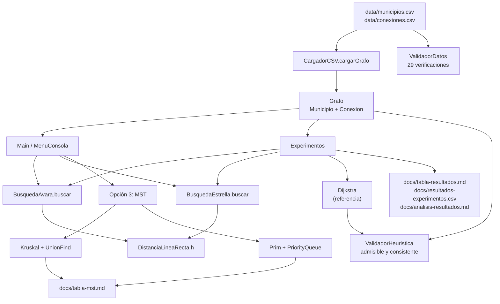

# Arquitectura del proyecto

Diagrama de clases y de paquetes. Sirve para responder rápido "dónde vive cada cosa" y para
enseñar cómo se relacionan el modelo, los datos, los algoritmos, el análisis y la interfaz.

## Paquetes

```
municipios/
├── modelo/     el grafo: qué es un municipio y cómo se conecta con otros
├── datos/      lectura de los CSV y control de calidad de esos archivos
├── algoritmo/  las búsquedas (avara y A*), la heurística, Dijkstra como referencia
│               y el árbol de expansión mínima (UnionFind, Kruskal, Prim)
├── analisis/   los experimentos y las tablas de resultados
└── ui/         el menú por consola y el punto de entrada
```

Las dependencias van siempre hacia adentro: `ui` y `analisis` usan `algoritmo`, `algoritmo`
usa `modelo`, y `modelo` no depende de nada. Solo `datos` lee archivos.

## Diagrama de clases

```mermaid
classDiagram
    direction LR

    class Municipio {
        -String nombre
        -double latitud
        -double longitud
        +getNombre() String
        +getLatitud() double
        +getLongitud() double
        +equals(Object) boolean
    }

    class Grafo {
        -Map~Municipio,List~ adyacencias
        -Map~String,Municipio~ porNombre
        +agregarMunicipio(Municipio) void
        +agregarConexion(Municipio, Municipio, double) void
        +getVecinos(Municipio) List~Conexion~
        +getDistancia(Municipio, Municipio) double
        +buscarPorNombre(String) Municipio
        +getMunicipios() List~Municipio~
        +getAristas() List~Arista~
    }

    class Conexion {
        <<record>>
        +Municipio destino
        +double distancia
    }

    class Arista {
        <<record>>
        +Municipio origen
        +Municipio destino
        +double distancia
    }

    class Heuristica {
        <<interface>>
        +h(Municipio actual, Municipio destino) double
    }

    class DistanciaLineaRecta {
        -double RADIO_TIERRA_KM
        +h(Municipio, Municipio) double
    }

    class ResultadoBusqueda {
        -List~Municipio~ camino
        -double costoTotal
        -int nodosExpandidos
        -boolean encontrado
        +getCamino() List~Municipio~
        +getCostoTotal() double
        +getNodosExpandidos() int
        +isEncontrado() boolean
    }

    class BusquedaAvara {
        -Grafo grafo
        -Heuristica heuristica
        +buscar(Municipio, Municipio) ResultadoBusqueda
        +buscar(String, String) ResultadoBusqueda
    }

    class BusquedaEstrella {
        -Grafo grafo
        -Heuristica heuristica
        +buscar(Municipio, Municipio) ResultadoBusqueda
        +buscar(String, String) ResultadoBusqueda
    }

    class Dijkstra {
        <<utility>>
        +distanciasDesde(Grafo, Municipio) Map
        +caminoMinimo(Grafo, Municipio, Municipio) List
        +costoMinimo(Grafo, Municipio, Municipio) double
        +expansionesHasta(Grafo, Municipio, Municipio) int
    }

    class ValidadorHeuristica {
        -Grafo grafo
        -Heuristica heuristica
        +generarReporte() String
        +validarBasicas() List
        +validarAdmisibilidad() List
        +validarConsistencia() List
    }

    class UnionFind {
        -int[] padre
        -int[] rango
        -int componentes
        +UnionFind(int) 
        +find(int) int
        +union(int, int) boolean
        +conectados(int, int) boolean
        +getComponentes() int
    }

    class ResultadoMST {
        -List~Arista~ aristas
        -double costoTotal
        -int aristasConsideradas
        -int aristasDescartadas
        -boolean conexo
        +getAristas() List~Arista~
        +getCostoTotal() double
        +getNumeroAristas() int
        +getAristasConsideradas() int
        +getAristasDescartadas() int
        +isConexo() boolean
    }

    class Kruskal {
        <<comparator>> ORDEN
        +calcular(Grafo) ResultadoMST
    }

    class Prim {
        <<comparator>> ORDEN
        +calcular(Grafo) ResultadoMST
        +calcular(Grafo, Municipio) ResultadoMST
    }

    class CargadorCSV {
        <<utility>>
        +cargarGrafo(Path, Path) Grafo
    }

    class ValidadorDatos {
        +validar() List
        +generarReporte() String
        +hayErrores() boolean
    }

    class Experimentos {
        -Grafo grafo
        -Heuristica heuristica
        -int repeticiones
        +ejecutar() List
        +escanearTodosLosPares() ResumenGlobal
        +tablaMarkdown(List) String
        +csv(List) String
        +analisis(List, ResumenGlobal) String
        +tablaMstMarkdown() String
    }

    class MenuConsola {
        -Grafo grafo
        -Algoritmo avara
        -Algoritmo aEstrella
        -List~AlgoritmoMST~ algoritmosMST
        +MenuConsola(Grafo, Algoritmo, Algoritmo, BufferedReader, PrintStream)
        +MenuConsola(Grafo, Algoritmo, Algoritmo, List, BufferedReader, PrintStream)
        +ejecutar() void
    }

    class Main {
        +main(String[]) void
    }

    Grafo "1" o-- "*" Municipio : municipios
    Grafo "1" *-- "*" Conexion : vecinos
    Arista --> Municipio : extremos
    Heuristica <|.. DistanciaLineaRecta
    BusquedaAvara --> Grafo : consulta
    BusquedaAvara --> Heuristica : usa
    BusquedaAvara ..> ResultadoBusqueda : devuelve
    BusquedaEstrella --> Grafo : consulta
    BusquedaEstrella --> Heuristica : usa
    BusquedaEstrella ..> ResultadoBusqueda : devuelve
    Dijkstra --> Grafo : consulta
    Kruskal --> Grafo : aristas del grafo
    Kruskal --> UnionFind : evita ciclos
    Kruskal ..> ResultadoMST : devuelve
    Kruskal ..> Arista : elige
    Prim --> Grafo : vecinos del frente
    Prim ..> ResultadoMST : devuelve
    Prim ..> Arista : elige
    ValidadorHeuristica --> Grafo : revisa
    ValidadorHeuristica --> Heuristica : evalúa
    ValidadorHeuristica --> Dijkstra : compara contra
    CargadorCSV ..> Grafo : construye
    ValidadorDatos ..> Grafo : no depende: lee los CSV
    Experimentos --> Grafo
    Experimentos --> Heuristica
    Experimentos --> BusquedaAvara
    Experimentos --> BusquedaEstrella
    Experimentos --> Dijkstra
    Experimentos --> Kruskal : tabla del MST
    Experimentos --> Prim : tabla del MST
    MenuConsola --> Grafo : lista municipios
    MenuConsola --> BusquedaAvara : ejecuta
    MenuConsola --> BusquedaEstrella : ejecuta
    MenuConsola ..> Kruskal : opción 3
    MenuConsola ..> Prim : opción 3
    Main ..> CargadorCSV : carga los datos
    Main ..> MenuConsola : abre el menú
```

## Cómo fluye un dato por el programa



1. `CargadorCSV` lee los dos CSV y construye el `Grafo`. Falla con un mensaje que dice el
   archivo y la línea si algo está mal.
2. `Main` crea la heurística (`DistanciaLineaRecta`), las dos búsquedas y el `MenuConsola`.
3. El menú pide origen y destino y llama a `buscar(origen, destino)` del algoritmo elegido.
4. Ambas búsquedas devuelven un `ResultadoBusqueda` con el camino, el costo, los municipios
   expandidos y si se encontró algo.
5. `Experimentos` hace lo mismo pero sobre una lista fija de pares y escribe los resultados.
6. La opción 3 del menú calcula el MST con Kruskal y con Prim, y ambos devuelven un
   `ResultadoMST` con las aristas elegidas, el costo total, las aristas descartadas y si el grafo
   quedó conexo.

## Puntos de diseño que conviene conocer

- **`Heuristica` es una interfaz, no una clase.** `BusquedaAvara` y `BusquedaEstrella` reciben
  una heurística cualquiera. Eso es lo que permite probar los algoritmos con valores de `h`
  inventados en un grafo de juguete, sin depender de coordenadas reales, y lo que permite
  comprobar qué pasa cuando la heurística *no* es admisible.
- **`Grafo` guarda las conexiones en los dos sentidos** al agregarlas. Ningún algoritmo tiene
  que comprobar si una arista es bidireccional, y `ValidadorDatos` verifica que el CSV no traiga la
  misma conexión dos veces.
- **`Dijkstra` es código de apoyo, no parte de la solución.** El menú nunca lo ofrece. Existe
  para dos cosas: comprobar que la heurística es admisible (issue #6) y decir cuál es el
  verdadero camino más corto, que es contra lo que se mide a A* y a la búsqueda avara
  (issues #9 y #15).
- **`ResultadoBusqueda` es inmutable y lo devuelven las dos búsquedas igual**, así que el menú
  y los experimentos pueden tratar los dos resultados de la misma manera.
- **`MenuConsola` recibe la entrada y la salida por parámetro.** Es lo que permite probarlo sin
  teclado: las pruebas le pasan un `StringReader` y capturan lo que escribe.

## Puntos de diseño del árbol de expansión mínima

- **`Grafo.getAristas()` devuelve cada conexión una sola vez.** El grafo guarda cada arista en los
  dos sentidos, así que `getVecinos` no sirve para contar conexiones: un MST sobre las 42
  conexiones de los datos reales necesita un solo sentido por conexión. `Arista(origen, destino,
  distancia)` es el `record` que usan Kruskal, Prim y `ResultadoMST`.
- **`UnionFind` es lo que hace que Kruskal no forme ciclos.** `union(a, b)` devuelve `false` si los
  dos municipios ya estaban en el mismo conjunto, y ese `false` es exactamente la señal de
  "esta arista cerraría un ciclo, se descarta". Trabaja sobre índices 0..n-1, así que Kruskal
  numera los municipios del grafo antes de llamarlo. Con compresión de caminos y unión por rango,
  `find` es prácticamente constante.
- **Kruskal y Prim usan el mismo `Comparator` de desempate.** Ordenan por km y, si hay empate, por
  el nombre alfabéticamente menor de los dos extremos y luego por el mayor. Sin eso, dos corridas
  con los mismos datos podrían elegir aristas distintas y la validación cruzada no significaría
  nada. El desempate no depende de qué extremo se llame origen, así que el resultado no cambia si
  el grafo se recorre al revés.
- **`Kruskal` no necesita municipio inicial; `Prim` sí.** Por eso Prim tiene dos firmas:
  `calcular(grafo)` usa el primer municipio del grafo y `calcular(grafo, inicio)` permite fijarlo.
  El costo total no depende del inicio (está probado con los 20 municipios), pero la lista de
  aristas puede cambiar si el grafo no es conexo.
- **Los dos devuelven `ResultadoMST` aunque el grafo no sea conexo.** Kruskal se queda con un
  bosque (`n - k` aristas para `k` componentes) y Prim solo cubre la componente del municipio
  inicial; en los dos casos `isConexo()` sale `false`. No es un error del algoritmo: es la
  respuesta correcta para un grafo desconectado, y el mismo aviso le sirve al menú para no
  presentar un bosque como si fuera un árbol.
- **`ResultadoMST` calcula el costo total en el constructor** sumando las aristas que recibió, y
  guarda la lista con `List.copyOf`. Es inmutable, igual que `ResultadoBusqueda`, así que el menú
  y la tabla generada lo tratan sin poder modificarlo.
- **Kruskal mira más aristas que Prim, y es esperable.** Kruskal recorre las 42 aristas en orden
  global y va descartando las que cierran ciclo (34 consideradas, 15 descartadas); Prim solo saca
  de la cola las aristas del frente de expansión (26 consideradas, 7 descartadas). Los dos
  terminan con 19 aristas y 3457,6 km.